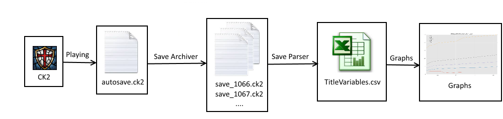

# CK2 game analyzer

> Tools to get some statistics about played CK2 games. 

CK2 game analyzer is a set of tools to highligh some data of the played CK2 games.
It can be useful for example to study some features of your mod.

The output of some tools will be the input of other tools but you can explore the data by yourself.

The current way is
1. Archive the savegames when playing
2. Extract data from savegames
3. Visualize some of these data

The developpement is iterative and based on existing tools.

## Installation
1. Download this project
2. Download and install RealTimeSync which is [distributed with FreeFileSync](https://www.freefilesync.org/download.php)

## Usage

### Save archiver

> Windows only

1. Start RealTimeSync

2. In folder to watch, add all your directory where CK2 savegames are stored (savegame main directory + mods directories).

3. Put `1` in idle time (RealTimeSync and our script are not many gluttonous, it wille be stupid to miss some savegames with a too important idle time)

4. Put a command line according this model : `wscript "<FreeFileSyncInstallDirectory>\HideConsole.vbs" "<CK2_game_analyzer Directory>\save_archiver\save_archiver.bat" %change_action% "%change_path%"`
All <XXX> are to be replaced by your own paths.
> Example : wscript "C:\Program Files\FreeFileSync\HideConsole.vbs" "C:\Users\Nicolas\Documents\GitHub\CK2_game_analyzer\save_archiver\save_archiver.bat" %change_action% "%change_path%"

Be sure that the directory `<CK2_game_analyzer Directory>\save_archiver\saves` is created or see the following advanced configuration.

5. Launch the game and play. If you want only collect data you can use the observe mod by typping observe in the game console.

6. When there is an autosave of the game, this autosave is archived in the directory `<CK2_game_analyzer Directory>\save_archiver\saves`.
Its name will be `save_test_XXXX.ck2` where XXXX is the in-game year in 4 digits.

#### Advanced configuration

1. You can change the output directory and/or the filename prefix.
To do this open `<CK2_game_analyzer Directory>\save_archiver\save_archiver.bat` with your favorite text editor (Notepad++ for example)
Replace the line `set "target=%~dp0%saves\save_test"` by what you want. `%~dp0%` is a varaible whose the value is the directory where the script is.
> Example : set "C:\Users\Nicolas\Documents\ck2SaveGames\L3T"

2. You can also change the behavior when the name output filename already exists.
By default the old archive is replaced by the new one.
If you replace the 0 of set erase=0 by something else, the archive will not be erased but the new autosave will not be archived.
> Example : set erase=1

#### Bug reports

The script creates a log file.
If you are not able to determine the cause of the bug, you can create an issue by indicating more information as possible (save game path, script path, target path, ...).

## Contributing

All contributions are welcomed.

1. Fork this project!
2. Create your feature branch: `git checkout -b my-new-feature`
3. Commit your changes: `git commit -am 'Add some feature'`
4. Push to the branch: `git push origin my-new-feature`
5. Submit a pull request
